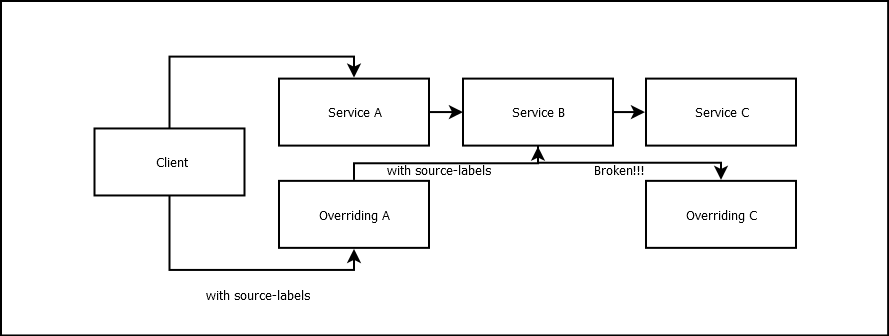

# Technical Overview

Dynamic Environment uses [_Istio_][istio]'s mesh capabilities to launch custom version of a
deployment and adds spacial routing based on HTTP request headers or source labels.

## Base Elements

We use the following steps to initialize a _DynamicEnvironment_:

### IstioMatches

IstioMatches corresponds to a small subset of [Istio's HTTPMatchRequest][match] (only _headers_ and
_source labels_). Currently the _DynamicEnvironment_ IstioMatches is translated to HTTPMatchRequest
as follows:

* All headers are grouped into a single HTTPMatchRequest
* All source-labels are grouped into a single HTTPMatchRequest

So if you consider the following IstioMatches object:

```yaml
[ ... ]
spec:
  istioMatches:
    - headers:
        end-user:
    - sourceLabels:
        end-user: json
  [ ... ]
```

Will produce the following _VirtualService_ http matches:

```yaml
[ ... ]
spec:
  http:
    - match:
        - headers:
            end-user:
              prefix: jason
      route:
        - destination:
            [ ... ]
    - match:
        - sourceLabels:
            end-user: json
      route:
        - destination:
            [ ... ]
    - route:
        - destination:
            [ ... ]
  [ ... ]
```

:::note

_DynamicEnvironment_ does not contain provisions to forward headers or source labels. It's the
responsibility of the tested application to forward headers if required.

:::

### Subsets

* We identify the deployment we want to override based on the _namespace_ / _name_ supplied in the
  _DynamicEnv_ manifest and then we clone it using the [provided
  overrides](../references/crd.md#subset) (with minor updates - e.g. set version, etc).
* We are identifying the service that use this deployment (so we'll have the service hostname). A
  deployment might have more than one service pointing to it. We'll soon support this (for now we
  only support single service for deployment).
* We identify the [_Destination Rule_][DR] that handles this service hostname (see previous bullet)
  for the default version and we clone it for this custom version.
* We scroll through all the [Virtual Services][VS] in the namespace and identify the ones that use
  the default destination rule. We then create custom routes in each of the virtual service that
  points to the new service using the provided [IstioMatch](../references/crd.md#istiomatch).

:::info

We also suppot [Delegate Virtual Service][delegate] - these are processed as pointers to the virtual
service that handles the routing. Note that delegates has various limitations and these limitations
also apply here.

:::

:::caution

Currently we only support a single service for each deployment. This will be changed soon. Remember
to update docs (and bullet above) and it's updated!

:::

### Consumers

Consumers are spacial case of [subsets](#subsets) that doesn't get traffic in. It's a convenience
helper for creating a worker that uses a new version (possibly to connect to new services). Because
it does not accept traffic we only clone the deployment (same as with subsets) without creating
_DestinationRule_ and _VirtualService_.

### Cleanup

When deleting a dynamic environment we delete all the new resources we created and remove the custom
routes from all the _Virtual Services_ we modified. This is performed with the help
of [finalizers][]. The deletion task is performed synchronously - it returns only once everything is
cleaned up.

:::danger

Since we use finalizers the same limitations as deleting any resource with finalizers apply here
also.

:::

### Status Explained

The [status][] is used for both conveying the status of the resource and for internal management of
resources.

The most important fields for understanding the status of a _DynamicEnv_ resource are:

* `state`: displays the calculated summary of all resources handled by this resource - _running_,
  _processing_, _degraded_.
* `totalCount` and `totalReady`: Displays the total number of subsets / consumers in this resource
  and how many of them are ready.

For troubleshooting you can look deeper into each of the _subsets_ or _consumers_ statuses. Here is
a (partial) sample of healthy subset (subset names are uniquely generated based on the original
deployment name and namespace).

```yaml
subsetsStatus:
  details-default-dynamicenv-status-updates:
    deployment:
      name: details-default-dynamicenv-status-updates
      namespace: status-updates
      status: running
    destinationRule:
      name: details-default-dynamicenv-status-updates
      namespace: status-updates
      status: running
    virtualServices:
      - name: details
        namespace: status-updates
        status: running
```

Here is an example of a subset that we could not find any service that serves the deployment we
override.

```yaml
      subsetsStatus:
        details-default-dynamicenv-global-virtual-service-errors:
          subsetErrors:
            virtualServices:
              - error: 'error updating virtual service for subset (details-default-dynamicenv-global-virtual-service-errors):
                     could not find any service matching host: details'
                lastOccurrence: "2023-09-01T10:28:20Z"
```

:::note

Almost all elements in the status can contain a list of errors with the time signature of last
occurence.

:::

And finally, for a quick status of all deployed _DynamicEnvironment_ resources you can run:

```shell
HOME ➤ kubectl get de
NAME                     STATUS   DESIRED   CURRENT   AGE
dynamicenv-sample        ready    3         3         3h17m
dynamicenv-simple-test   ready    1         1         12s
```

You can see that all subsets/consumers of each resource are ready.

The [status][] page contains full details for all fields.

## SourceLabels Propagation

While it's not the responsibility of this operator to propagate source-labels we do offer the option
to add specific source-labels to the deployments we create. See the `podLabels` field in
the [CRD Subset reference](../references/crd.md#subset).

Note however that you can not trust this mechanism to carry the source labels through the entire
services path. Consider the following flow:



If we want to control the routing via source-labels we encounter a problem

1. The client sends a request with valid source-labels to `Service A` (reaching `Overriding A`
   because of source-labels).
2. `Overriding A` sends a request to `Service B` with source-labels but because we do not
   override `Service B` it reaches the default `Service B`.
3. Our testing flow requires us to get to `Overriding C` when we send request to `Service C`,
   however, since `Service B` is the default one it does not contain the required source-labels and
   we will never reach `Overriding C` in this flow.

To solve this problem we can override `Service B` (without any modifications - just add
source-labels). This way we can reach the entire flow of our app.

## Workflows, Events, etc

### Getting notified about modifications in resources we control

When we create a new _Dynamic Environment_ custom resource it triggers
a [reconcile loop][reconcile-loop]. Every time there's an event related to this specific manifest
the reconcile loop is triggered. This means that every time we update the manifest the reconcile
loop will run. However, this is not the only event that triggers the loop. We create and modify
various resources (Deployments, DestinationRules and VirtualServices) and we want to get notified
whenever they are modified (e.g. deleted by mistake). Since we are not limited to specific namespace
when creating / updating resources we can not *own* this resource. We have to use other means to get
notified when something has changed. We are using [event handlers][event-handlers] for this purpose.
This happens in a form of annotation added to the resource. This
annotation (`riskified.com/dynamic-environment`) if not empty, triggers configured reconcile loop.

While this behaviour is behind the scenes and we should not really care about it we should pay
attention to the following:

* If we modify a resource created by _Dynamic Environment_ (Deployment / DestinationRule) not via
  updating the _DynamicEnv_ resource these changes will probably get deleted (or even worse, it will
  cause an unknown error).
* If you see the annotation above in your resources (e.g. virtual services - these are not created
  by us but they are updated) you'll know why.

### How virtualServices are handled

:::warning

This section is just a placeholder. It will be written once we implement support for multiple
services per service name.

:::

[Virtual services][VS] are not created by the operator. When we identify the service hostname(s) the
original deployment is connected to, we loop through all the virtual services searching for ones
that handle our service. If this service is a [delegate][] we are searching in the virtual service
that this delegate points to. When we finalize the list of affected virtual services, we iterate
through it's routes and when we identify a route that's related to our service we add an updated
route (with our matchers) just in front of this route. These routes are also identified by unique
names so we could identify them easily when deleting the routes.

TO BE CONTINUED...

[istio]: https://istio.io/

[DR]: https://istio.io/latest/docs/reference/config/networking/destination-rule/

[VS]: https://istio.io/latest/docs/reference/config/networking/virtual-service/

[delegate]: https://istio.io/latest/docs/reference/config/networking/virtual-service/#Delegate

[reconcile-loop]: https://sdk.operatorframework.io/docs/building-operators/golang/tutorial/#reconcile-loop

[event-handlers]: https://pkg.go.dev/sigs.k8s.io/controller-runtime/pkg/handler@v0.14.5#EventHandler

[finalizers]: https://kubernetes.io/docs/concepts/overview/working-with-objects/finalizers/

[status]: ../references/crd.md#dynamicenvstatus

[match]: https://istio.io/latest/docs/reference/config/networking/virtual-service/#HTTPMatchRequest