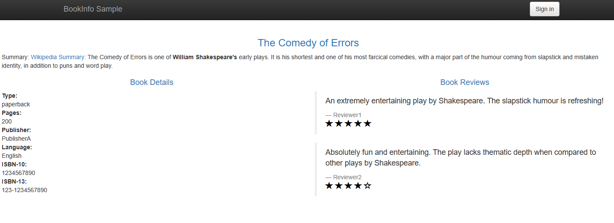
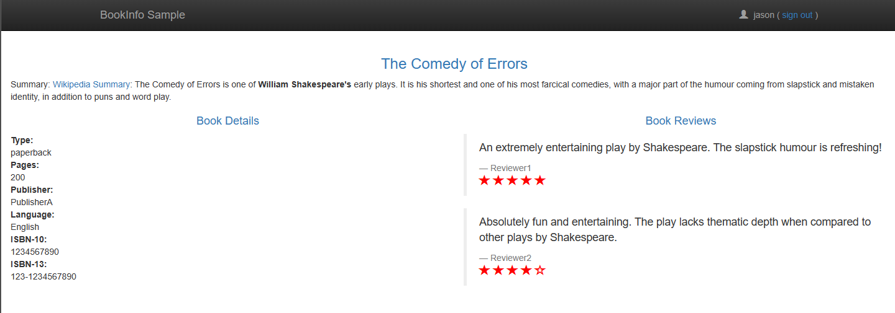

# Running the Sample Application

In this section of the tutorial we will install a sample application and create a dynamic env to
test a new version of a single service within the application. The application we'll use is slightly
modified clone of the _BookInfo_ application that is distributed with _Istio_. If you're not
familiar with the BookInfo sample application, it's a book into page that contains 3 versions of
ranking element:

* A text only (we'll not see it here)
* A black stars rating
* A coloured stars rating

In the [Istio tutorial](https://istio.io/latest/docs/examples/bookinfo/) you're installing the 3
versions above and depending on the logged in user you are routed to the configured version for set
user. This is achieved by the the fact that the logged in user is translated to `end-user` header
and is matched by _Istio_'s virtual service (familiarity with how _Istio_ works is a requirement to
use this product). Unlike the _Istio_ tutorial, we will only install a single version (the _black
stars rating_). In our scenario we are currently developing the coloured stars rating and we want to
test it before distributing.

:::note

Before continuing make sure you followed the previous steps of this tutorial and you now have a
working kubernetes cluster with required dependencies and _Dynamic Environment_ deployed.

:::

## Installing the BookInfo Application

Download the [tutorial files](./assets/files/running-tutorial.zip), extract them, and
install `bookinfo.yml` manifest:

```shell
kubectl apply -f bookinfo.yml
```

This will create a BookInfo application running in the `dynenv-tutorial` namespace. It will install
4 services:

```shell
✓ ~ ➤ kubectl get -n dynenv-tutorial service
NAME          TYPE        CLUSTER-IP      EXTERNAL-IP   PORT(S)    AGE
details       ClusterIP   10.96.243.70    <none>        9080/TCP   3m40s
productpage   ClusterIP   10.96.169.74    <none>        9080/TCP   3m39s
ratings       ClusterIP   10.96.215.213   <none>        9080/TCP   3m40s
reviews       ClusterIP   10.96.106.203   <none>        9080/TCP   3m40s
```

Also note the configured routes within the _reviews_ virtual service (only a single route):

```shell
      ✓ ~ ➤ kubectl get -n dynenv-tutorial vs reviews -o yaml
      apiVersion: networking.istio.io/v1beta1
      kind: VirtualService
      metadata:
          riskified.com/dynamic-environment: ""
        name: reviews
        namespace: dynenv-tutorial
        [...]
      spec:
        hosts:
        - reviews
        http:
        - route:
          - destination:
              host: reviews
              subset: shared
```

Access the `productpage` service (e.g. by creating a port-forward). Go to the `/productpage` url (
e.g. `http://localhost:9080/productpage`). You should see something similar to this:



## Testing the Coloured Rating using Dynamic Environment

Now that you developed a coloured stars rating element you want to test it before distributing it to
the world. In our example you updated the `reviews` application and uploaded a docker image to the
registry. Now let's create a _dynamic environemnt_ manifest to test our application. Here's the
final manifest (is is also included in the downloaded `tutorial.zip` archive):

```yaml title=dynamicenv-bookinfo.yml
---
apiVersion: riskified.com/v1alpha1
kind: DynamicEnv
metadata:
  name: dynamicenv-sample
spec:
  istioMatches:
    - headers:
        end-user:
          exact: jason
  subsets:
    - name: reviews
      namespace: dynenv-tutorial
      image: docker.io/istio/examples-bookinfo-reviews-v3:1.16.2
```

A few notes about the manifest:

* Namespace: The _dynamic environment_ custom resource is not restricted to be deployed in the same
  namespace as the resources it manipulates. It could be deployed on any namespace.
* Match: For testing we're matching against a header of `end-user` with exact value of `jason` (in
  our application we need to log in as `jason` for this header to be created).
* Subset: In our case we replace only a single subset (identified by it's _deployment_ name and
  namespace). Note that in our case we're only changing the image.

Apply this manifest:

```shell
kubectl apply -f dynamicenv-bookinfo.yml
```

Now you can view the dynamic environment status by running:

```shell
✓ ~ ➤ kubectl get de dynamicenv-sample -o yaml
apiVersion: riskified.com/v1alpha1
kind: DynamicEnv
metadata:
  [...] # skipped
  finalizers:
  - DeleteDeployments
  - DeleteDestinationRules
  - CleanupVirtualServices
  name: dynamicenv-sample
  namespace: default
  [...] # skipped
spec:
    [...] # skipped
status:
  state: ready
  subsets-status:
    reviews-default-dynamicenv-sample:
      deployment:
        name: reviews-default-dynamicenv-sample
        namespace: dynenv-tutorial
        status: running
      destination-rule:
        name: reviews-default-dynamicenv-sample
        namespace: dynenv-tutorial
        status: running
      virtual-services:
      - name: reviews
        namespace: dynenv-tutorial
        status: running
```

A few things to note about this status:

* You can see in the `status:` section that our global `state:` is _ready_.
* Also, for each subset you can see all the elements that we created or modified to configure the
  routing. If there are errors they should also appear here.
* You can see that we've added finalizers. We will use these finalizers (and the various state
  elements) to restore previous state on deletion.
* You can also note that for each subset we create a new deployment, a new destination rule and we
  are editing the relevant virtual services.

Now, let's test our application. Refresh the product page. Nothing should change. Try to login as
various usernames (no password is needed) and you should still see the black stars rating. However,
if you login as user _jason_ you should see something like this (note the coloured ratings):



Let's see some of the changes:

* Added deploys (the last deployment is the one we created - the name contains the name of the
  dynamic environment):

      ✓ ~ ➤ kubectl get -n dynenv-tutorial deploy
      NAME                                READY   UP-TO-DATE   AVAILABLE   AGE
      details                             1/1     1            1           73m
      details-worker                      1/1     1            1           73m
      productpage                         1/1     1            1           73m
      ratings                             1/1     1            1           73m
      reviews                             1/1     1            1           73m
      reviews-default-dynamicenv-sample   1/1     1            1           25m

* Added destination rule (same name convention as the deployments):

      ✓ ~ ➤ kubectl get -n dynenv-tutorial dr
      NAME                                HOST          AGE
      details                             details       75m
      productpage                         productpage   75m
      ratings                             ratings       75m
      reviews                             reviews       75m
      reviews-default-dynamicenv-sample   reviews       27m

* We modified the relevant virtual service and added a route based on the configured match (skipped
  part of the output) - See the [reference documentation for virtual hosts](#) for more details on
  manipulating virtual services:

      ✓ ~ ➤ kubectl get -n dynenv-tutorial vs reviews -o yaml
      apiVersion: networking.istio.io/v1beta1
      kind: VirtualService
      metadata:
          riskified.com/dynamic-environment: default/dynamicenv-sample
        name: reviews
        namespace: dynenv-tutorial
      spec:
        hosts:
        - reviews
        http:
        - headers:
            response:
              set:
                x-dynamic-env: reviews-default-dynamicenv-sample
          match:
          - headers:
              end-user:
                exact: jason
          name: dynamic-environment-default-dynamicenv-sample-reviews-95c3950f70
          route:
          - destination:
              host: reviews
              subset: default-dynamicenv-sample
        - route:
          - destination:
              host: reviews
              subset: shared

Now delete the dynamic environment and verify that everything is back to normal...

