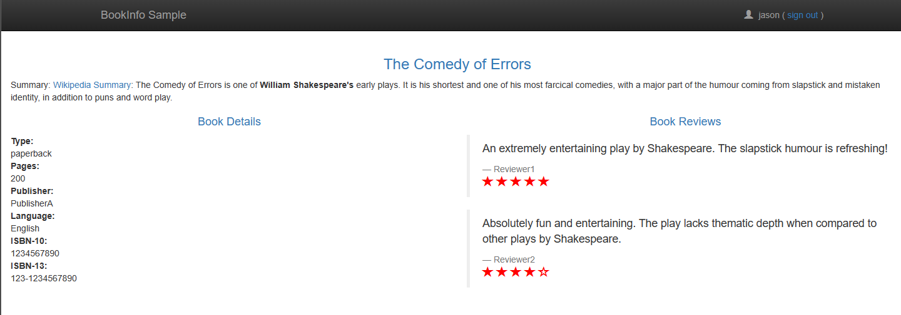

# Running the Sample Application

In this section of the tutorial, we will demonstrate the installation of a sample application and
how to create a dynamic environment to test a new version of a single service within the
application. The application we're using is a slightly modified clone of the _BookInfo_ application
that comes with _Istio_. For more detailed information about Istio's BookInfo application, you can
refer to the [application page][bookinfo].

:::note

Before proceeding, ensure that you have followed the prerequisites outlined in the previous sections
of this tutorial. You should have a functional Kubernetes cluster with the required dependencies and
_Dynamic Environment_ deployed.

:::

## Installing the BookInfo Application

Begin by downloading the [tutorial files](../assets/files/running-tutorial.zip), extracting the
archive, and then installing the `bookinfo.yml` manifest using the following command:

```shell
kubectl apply -f bookinfo.yml
```

This will create a BookInfo application running in the `dynenv-tutorial` namespace. It consists of
four services:

```shell
✓ ~ ➤ kubectl get -n dynenv-tutorial service
NAME          TYPE        CLUSTER-IP      EXTERNAL-IP   PORT(S)    AGE
details       ClusterIP   10.96.243.70    <none>        9080/TCP   3m40s
productpage   ClusterIP   10.96.169.74    <none>        9080/TCP   3m39s
ratings       ClusterIP   10.96.215.213   <none>        9080/TCP   3m40s
reviews       ClusterIP   10.96.106.203   <none>        9080/TCP   3m40s
```

Additionally, note the configured routes within the _reviews_ virtual service (only a single route):

```shell
      ✓ ~ ➤ kubectl get -n dynenv-tutorial vs reviews -o yaml
      apiVersion: networking.istio.io/v1beta1
      kind: VirtualService
      metadata:
          riskified.com/dynamic-environment: ""
        name: reviews
        namespace: dynenv-tutorial
        [...]
      spec:
        hosts:
        - reviews
        http:
        - route:
          - destination:
              host: reviews
              subset: shared
```

You can access the `productpage` service, for example, by creating a port-forward. Navigate to
the `/productpage` URL (e.g., `http://localhost:9080/productpage`). You should see something similar
to this:


## Testing the Colored Rating using Dynamic Environment

Now, let's say you've developed a feature like colored stars in the ratings element, and you want to
test it before making it available to all users. In this example, you've made updates to
the `reviews` application and uploaded a Docker image to the registry. To test your application, you
can create a dynamic environment manifest. Here's the final manifest (also included in the
downloaded `tutorial.zip` archive):

```yaml title=dynamicenv-bookinfo.yml
---
apiVersion: riskified.com/v1alpha1
kind: DynamicEnv
metadata:
  name: dynamicenv-sample
spec:
  istioMatches:
    - headers:
        end-user:
          exact: jason
  subsets:
    - name: reviews
      namespace: dynenv-tutorial
      image: docker.io/istio/examples-bookinfo-reviews-v3:1.16.2
```

:::note

You can find reference documentation for the `DynamicEnv` Custom Resource Definition (
CRD) [here](../references/crd.md).

:::

A few notes about the manifest:

* Namespace: The _dynamic environment_ custom resource is not limited to deployment in the same
  namespace as the resources it manipulates. It can be deployed in any namespace.
* Match: For testing, we're matching against a header named `end-user` with the exact value
  of `jason`. In our application, you need to log in as `jason` for this header to be created.
* Subset: In our case, we're replacing only a single subset identified by its _deployment_ name and
  namespace. Please note that we're only changing the image.

To apply this manifest, run the following command:

```shell
kubectl apply -f dynamicenv-bookinfo.yml
```

Now, you can check the dynamic environment's status by running:

```shell
✓ ~ ➤ kubectl get de dynamicenv-sample -o yaml
apiVersion: riskified.com/v1alpha1
kind: DynamicEnv
metadata:
  [...] # skipped
  finalizers:
  - DeleteDeployments
  - DeleteDestinationRules
  - CleanupVirtualServices
  name: dynamicenv-sample
  namespace: default
  [...] # skipped
spec:
    [...] # skipped
status:
  state: ready
  subsets-status:
    reviews-default-dynamicenv-sample:
      deployment:
        name: reviews-default-dynamicenv-sample
        namespace: dynenv-tutorial
        status: running
      destination-rule:
        name: reviews-default-dynamicenv-sample
        namespace: dynenv-tutorial
        status: running
      hash: [...]
      virtual-services:
      - name: reviews
        namespace: dynenv-tutorial
        status: running
  totalCount: 1
  totalReady: 1
```

A few things to note about this status:

* In the `status` section, you can see that the global `state` is _ready_.
* For each subset, you can see all the elements that have been created or modified to configure the
  routing. Any errors should also appear here.
* Finalizers are added, which will be used to restore the previous state upon deletion.
* For each subset, a new deployment, a new destination rule, and relevant virtual services are
  created or modified.
* For more details about the status, you can refer to
  the [reference documentation](../references/crd.md#dynamicenvstatus) and the corresponding section
  in the [technical overview](../advanced/technical-overview.md#status-explained) document.

Now, let's test our application. Refresh the product page. nothing should change. Try logging in
with various usernames (no password is needed), and you should still see the black stars rating.
However, if you log in as the user _jason_, you should see something like this (notice the colored
ratings):



Let's observe some of the changes:

* Added deployments (the last deployment is the one created for the dynamic environment - its name
  contains the name of the dynamic environment):

      ✓ ~ ➤ kubectl get -n dynenv-tutorial deploy
      NAME                                READY   UP-TO-DATE   AVAILABLE   AGE
      details                             1/1     1            1           73m
      details-worker                      1/1     1            1           73m
      productpage                         1/1     1            1           73m
      ratings                             1/1     1            1           73m
      reviews                             1/1     1            1           73m
      reviews-default-dynamicenv-sample   1/1     1            1           25m

* Added destination rules (following the same naming convention as the deployments):

      ✓ ~ ➤ kubectl get -n dynenv-tutorial dr
      NAME                                HOST          AGE
      details                             details       75m
      productpage                         productpage   75m
      ratings                             ratings       75m
      reviews                             reviews       75m
      reviews-default-dynamicenv-sample   reviews       27m

* We modified the relevant virtual service and added a route based on the configured match (skipped
  part of the output). You can refer to the [reference documentation for virtual hosts][vh] for more
  details on manipulating virtual services.

      ✓ ~ ➤ kubectl get -n dynenv-tutorial vs reviews -o yaml
      apiVersion: networking.istio.io/v1beta1
      kind: VirtualService
      metadata:
          riskified.com/dynamic-environment: default/dynamicenv-sample
        name: reviews
        namespace: dynenv-tutorial
      spec:
        hosts:
        - reviews
        http:
        - headers:
            response:
              set:
                x-dynamic-env: reviews-default-dynamicenv-sample
          match:
          - headers:
              end-user:
                exact: jason
          name: dynamic-environment-default-dynamicenv-sample-reviews-95c3950f70
          route:
          - destination:
              host: reviews
              subset: default-dynamicenv-sample
        - route:
          - destination:
              host: reviews
              subset: shared

Finally, you can delete the dynamic environment and verify that everything returns to its original
state.

[bookinfo]: https://istio.io/v1.17/docs/examples/bookinfo/
 
[vh]: ../advanced/technical-overview.md#how-virtual-services-are-handled