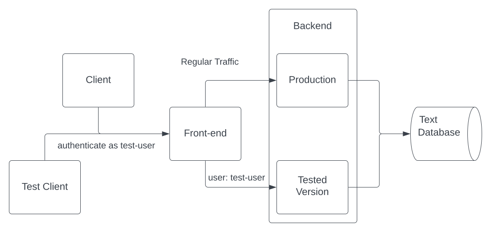

# Overview

_DynamicEnvironment_ is a kubernetes operator that enables service developers to launch alternative
versions of selected services while sharing the existing cluster, allowing a faster and cheaper
environment [^1] for testing and development than starting the entire architecture every time. To
perform this task, DynamicEnvironment uses the mesh capabilities of [_Istio_][istio].

Consider the following service description:



This is a service that consists of the following elements:

* Front-end
* Backend (deployment is named `my-namespace/backend`)
* Database

Regular traffic goes through the _front-end_ to the _backend_ and to the database.

When we want to test a new version of the backend we can create a new manifest as follows:

```yaml
apiVersion: riskified.com/v1alpha1
kind: DynamicEnv
metadata:
  name: dynamicenv-sample
spec:
  istioMatches:
    - headers:
        user:
          exact: test-user
  subsets:
    - name: backend
      namespace: my-namespace
      containers:
        - containerName: backend
          image: backend-image:test-version
```

_DynamicEnvironment_ will launch a parallel backend (called _Tested Version_ in the graph) with the
version to test and route all traffic with `user` header set to `test-user` to this backend.

A test client can authenticate as `test-user` and after authentication requests from front-end that
contains a `user` header with value `front-end` will be routed to the test backend [^2] (while using the
upstream database).

[^1]: _environemnt_ referring to a stack of selected services in the kubernetes cluster that is
approachable only through a dedicated entry point
[^2]: alternatively, send a request directly to the backend with header `user=test-user`.

[istio]: https://istio.io/