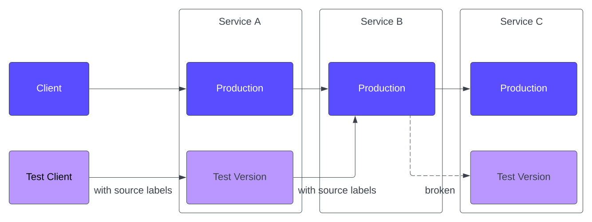

# Tips and Tricks

This document offers advanced tips and tricks for working with _DynamicEnvironment_.

## SourceLabels Propagation

While _DynamicEnvironment_ is not responsible for propagating source-labels throughout the services
path, it does provide the option to add specific source-labels to the deployments it creates. You
can achieve this using the `podLabels` field in
the [CRD Subset reference](../references/crd.md#subset).

It's important to note that you cannot solely rely on this mechanism to carry source-labels across
the entire service flow. Consider the following scenario:

In this situation, when controlling routing based on source-labels, you may encounter a challenge:

1. The test client sends a request with valid source-labels to `Service A`, resulting in it reaching
   the "Test Version" due to the source-labels.
2. However, when "Service A" sends a request to `Service B`, the lack of duplication for "Service B"
   results in it reaching the production version of "Service B".
3. The testing flow requires reaching the "Test Version" of "Service C" when sending a request to "
   Service C." However, since "Service B" is in production and lacks the required source-labels,
   the "Test Version" of "Service C" is never reached within this flow.

To address this issue, you can override "Service B" by adding source-labels without any other
modifications. This allows you to complete the entire flow of your application successfully.
