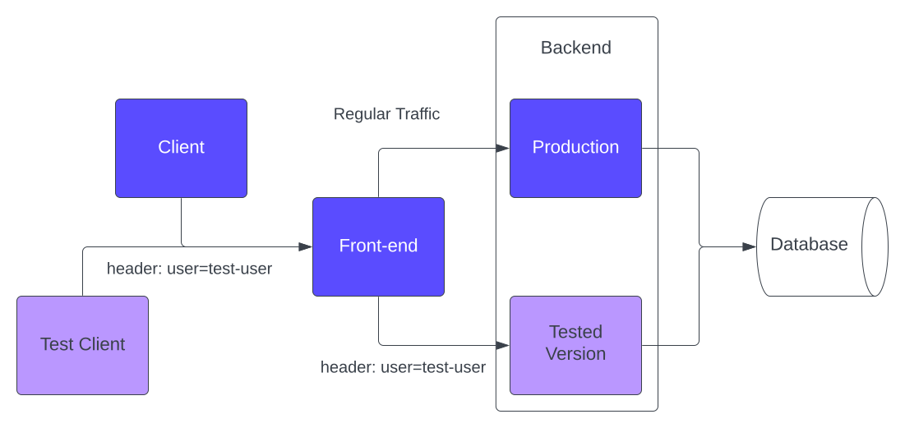

# Overview

DynamicEnv is an innovative Kubernetes operator created to empower developers by simplifying the
process of launching on-demand environments. This operator enables developers to efficiently deploy
different versions of specific services within a single Kubernetes cluster.

This approach offers a cost-effective and streamlined solution for testing and development, as
opposed to the conventional method of setting up the entire architecture for each iteration.

DynamicEnv harnesses the capabilities of [_Istio_][istio] to achieve this goal.

Let's consider a service description:



This service consists of the following components:

* Front-end
* Backend (deployment is named `my-namespace/backend`)
* Database

Typically, regular traffic flows from the front-end to the backend and then to the database.

When you need to test a new version of the backend, you can create a new manifest like this:

```yaml
apiVersion: riskified.com/v1alpha1
kind: DynamicEnv
metadata:
  name: dynamicenv-sample
spec:
  istioMatches:
    - headers:
        user:
          exact: test-user
  subsets:
    - name: backend
      namespace: my-namespace
      containers:
        - containerName: backend
          image: backend-image:test-version
```

DynamicEnv triggers the deployment of an additional backend (referred to as the "Tested Version" in
the diagram) featuring the version that requires testing. It directs all incoming traffic with a
"user" header set to "test-user" toward this newly deployed backend.

To enable testing, a test client can add a `user=test-user` header. If the front-end forwards this
header to the backend (note that this is the application's responsibility, not the operator's), the
request will be routed to the test backend [^1]. This ensures requests are directed to the
appropriate backend while maintaining connectivity with the upstream database.

[^1]: Alternatively, send a request directly to the backend with the header `user=test-user`.

[istio]: https://istio.io/